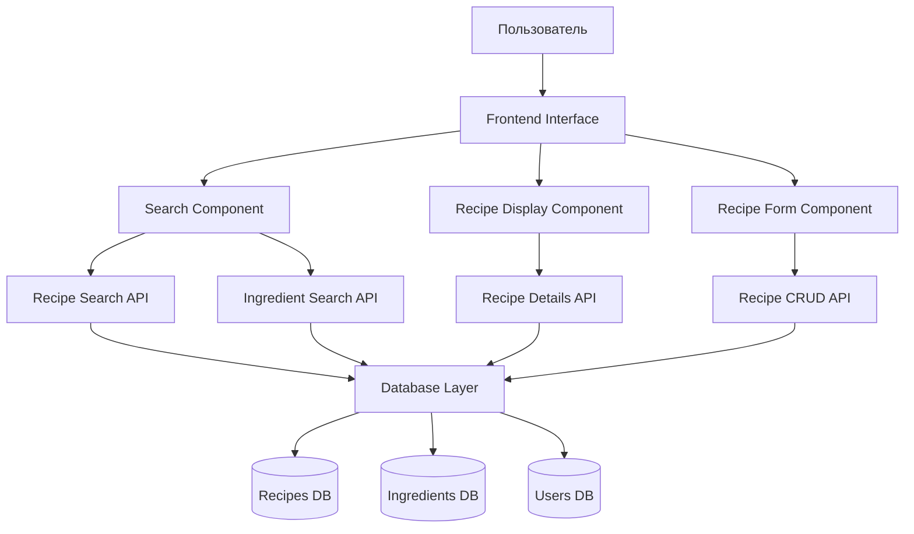
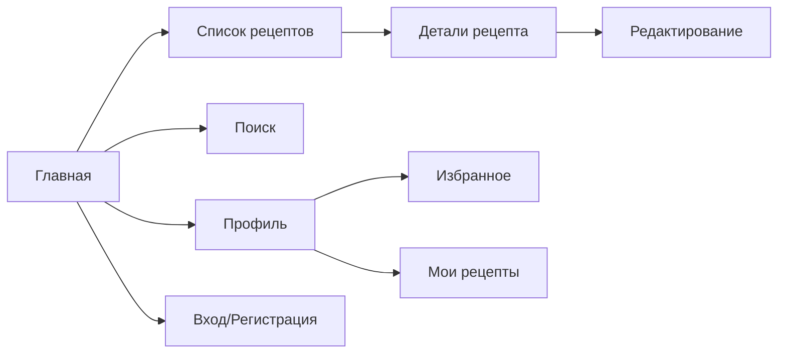

# Система Рецептов с Рисованным Дизайном

## Overview

Веб-приложение "Система рецептов" представляет собой интерактивную платформу для хранения, поиска и управления кулинарными рецептами с уникальным рисованным дизайном. Приложение предназначено для домашних поваров, студентов и всех, кто любит готовить.

**Ключевые особенности:**
- Рисованный hand-drawn дизайн интерфейса
- Двойная система поиска (по названию и ингредиентам)
- Интуитивное управление рецептами
- Адаптивный дизайн для всех устройств

## Technology Stack & Dependencies

**Frontend:**
- HTML5, CSS3, JavaScript (ES6+)
- CSS Framework: Custom hand-drawn styling
- Icons: Hand-drawn SVG иконки
- Fonts: Comic Sans MS, Kalam, или аналогичные "рукописные" шрифты

**Backend:**
- Node.js с Express.js
- База данных: SQLite (для простоты) или MongoDB
- Система аутентификации: JWT

**Дополнительные библиотеки:**
- Rough.js для создания рисованных элементов
- Fuse.js для улучшенного поиска
- Multer для загрузки изображений

## Architecture



## Component Architecture

### 1. Main Layout Components

**AppHeader (Шапка сайта)**
- Рисованный логотип в виде поварского колпака
- Навигационное меню с hand-drawn кнопками
- Пользовательский профиль (если авторизован)

**SearchBar (Строка поиска)**
- Двойная система поиска:
  - Поиск по названию рецепта
  - Поиск по ингредиентам
- Автодополнение для ингредиентов
- Фильтры (время приготовления, сложность, категория)

**RecipeCard (Карточка рецепта)**
- Рисованная рамка в стиле скетча
- Изображение блюда
- Название рецепта (рукописный шрифт)
- Время приготовления (с иконкой часов)
- Рейтинг звездочками
- Список основных ингредиентов

### 2. Recipe Management Components

**RecipeForm (Форма добавления/редактирования рецепта)**
- Поля ввода с рисованными границами
- Загрузка фото блюда
- Список ингредиентов с возможностью добавления/удаления
- Пошаговые инструкции
- Теги и категории

**RecipeDetail (Детальный вид рецепта)**
- Полная информация о рецепте
- Пошаговые инструкции с нумерацией
- Список покупок на основе ингредиентов
- Комментарии и рейтинги
- Кнопка "Добавить в избранное"

### 3. User Interface Components

**UserProfile (Профиль пользователя)**
- Мои рецепты
- Избранные рецепты
- История поиска
- Настройки профиля

**CategoryFilter (Фильтр по категориям)**
- Завтраки, обеды, ужины
- Десерты, напитки
- Вегетарианские, веганские
- По времени приготовления

## Data Models & Database Schema

### Recipe Model
```javascript
{
  id: String,
  title: String,
  description: String,
  ingredients: [
    {
      name: String,
      quantity: String,
      unit: String
    }
  ],
  instructions: [String],
  cookingTime: Number,
  difficulty: String, // easy, medium, hard
  category: String,
  tags: [String],
  image: String,
  rating: Number,
  author: String,
  createdAt: Date,
  updatedAt: Date
}
```

### Ingredient Model
```javascript
{
  id: String,
  name: String,
  category: String, // vegetables, meat, dairy, etc.
  synonyms: [String] // для улучшения поиска
}
```

### User Model
```javascript
{
  id: String,
  username: String,
  email: String,
  password: String, // хешированный
  favorites: [recipeId],
  myRecipes: [recipeId],
  createdAt: Date
}
```

## API Endpoints Reference

### Recipe Endpoints

**GET /api/recipes**
- Получение списка всех рецептов
- Query параметры: page, limit, category, difficulty
- Response: массив рецептов с пагинацией

**GET /api/recipes/search**
- Поиск рецептов по названию
- Query: ?q=название_рецепта
- Response: массив найденных рецептов

**GET /api/recipes/search-by-ingredient**
- Поиск рецептов по ингредиентам
- Query: ?ingredient=свекла
- Response: массив рецептов содержащих указанный ингредиент

**GET /api/recipes/:id**
- Получение детальной информации о рецепте
- Response: полный объект рецепта

**POST /api/recipes**
- Создание нового рецепта
- Auth: требуется авторизация
- Body: объект рецепта
- Response: созданный рецепт

**PUT /api/recipes/:id**
- Обновление существующего рецепта
- Auth: требуется авторизация (только автор)
- Body: обновленные поля
- Response: обновленный рецепт

**DELETE /api/recipes/:id**
- Удаление рецепта
- Auth: требуется авторизация (только автор)
- Response: статус успеха

### Ingredient Endpoints

**GET /api/ingredients**
- Получение списка всех ингредиентов
- Response: массив ингредиентов

**GET /api/ingredients/autocomplete**
- Автодополнение для поиска ингредиентов
- Query: ?q=све
- Response: массив подходящих ингредиентов

### User Endpoints

**POST /api/auth/register**
- Регистрация нового пользователя
- Body: {username, email, password}
- Response: JWT token

**POST /api/auth/login**
- Вход в систему
- Body: {email, password}
- Response: JWT token

**GET /api/user/profile**
- Получение профиля пользователя
- Auth: требуется авторизация
- Response: данные пользователя

**POST /api/user/favorites/:recipeId**
- Добавление рецепта в избранное
- Auth: требуется авторизация
- Response: статус успеха

## Styling Strategy (Hand-Drawn Design)

### Color Palette
```css
:root {
  /* Основные цвета */
  --primary-color: #FF6B6B;     /* Красный для акцентов */
  --secondary-color: #4ECDC4;   /* Бирюзовый для кнопок */
  --accent-color: #FFE66D;      /* Желтый для выделения */
  
  /* Нейтральные цвета */
  --background-color: #FFF8E7;  /* Кремовый фон */
  --text-color: #2C3E50;        /* Темно-синий для текста */
  --border-color: #34495E;      /* Для рисованных границ */
  
  /* Дополнительные */
  --success-color: #2ECC71;     /* Зеленый */
  --warning-color: #F39C12;     /* Оранжевый */
  --error-color: #E74C3C;       /* Красный для ошибок */
}
```

### Typography
```css
/* Основные шрифты */
.handwritten {
  font-family: 'Kalam', 'Comic Sans MS', cursive;
  font-weight: 400;
}

.handwritten-bold {
  font-family: 'Kalam', 'Comic Sans MS', cursive;
  font-weight: 700;
}

/* Размеры текста */
.text-xl { font-size: 2rem; }
.text-lg { font-size: 1.5rem; }
.text-md { font-size: 1.2rem; }
.text-sm { font-size: 1rem; }
```

### Hand-Drawn Elements
```css
/* Рисованные границы */
.sketch-border {
  border: 2px solid var(--border-color);
  border-radius: 15px;
  position: relative;
}

.sketch-border::before {
  content: '';
  position: absolute;
  top: -2px;
  left: -2px;
  right: -2px;
  bottom: -2px;
  border: 2px solid var(--border-color);
  border-radius: 18px;
  transform: rotate(0.5deg);
  z-index: -1;
}

/* Рисованные кнопки */
.sketch-button {
  background: var(--secondary-color);
  border: 2px solid var(--border-color);
  border-radius: 12px;
  padding: 12px 24px;
  font-family: 'Kalam', cursive;
  font-weight: 600;
  cursor: pointer;
  transform: rotate(-0.5deg);
  transition: all 0.2s ease;
}

.sketch-button:hover {
  transform: rotate(0deg) scale(1.05);
  box-shadow: 3px 3px 0px var(--border-color);
}
```

## State Management

### Local State (Component Level)
- Состояние форм (добавление/редактирование рецепта)
- UI состояния (модальные окна, выпадающие меню)
- Локальные фильтры и сортировка

### Global State (Application Level)
- Аутентификация пользователя
- Список всех рецептов
- Результаты поиска
- Избранные рецепты
- Корзина ингредиентов для покупок

### State Structure
```javascript
const globalState = {
  user: {
    isAuthenticated: false,
    userData: null,
    favorites: []
  },
  recipes: {
    allRecipes: [],
    searchResults: [],
    currentRecipe: null,
    loading: false,
    error: null
  },
  search: {
    query: '',
    searchType: 'title', // 'title' or 'ingredient'
    filters: {
      category: '',
      difficulty: '',
      cookingTime: ''
    }
  },
  ui: {
    showModal: false,
    modalType: null,
    theme: 'light'
  }
}
```

## Business Logic Layer

### Recipe Management Service

**RecipeService**
- `getAllRecipes()` - получение всех рецептов
- `getRecipeById(id)` - получение рецепта по ID
- `createRecipe(recipeData)` - создание нового рецепта
- `updateRecipe(id, updates)` - обновление рецепта
- `deleteRecipe(id)` - удаление рецепта
- `addToFavorites(recipeId)` - добавление в избранное
- `removeFromFavorites(recipeId)` - удаление из избранного

### Search Service

**SearchService**
- `searchByTitle(query)` - поиск по названию рецепта
- `searchByIngredient(ingredient)` - поиск по ингредиенту
- `getAutocompleteSuggestions(query)` - автодополнение
- `filterRecipes(filters)` - фильтрация рецептов
- `sortRecipes(sortBy, order)` - сортировка результатов

### Validation Service

**ValidationService**
- `validateRecipe(recipeData)` - валидация данных рецепта
- `validateUser(userData)` - валидация пользовательских данных
- `sanitizeInput(input)` - очистка пользовательского ввода

## Routing & Navigation

### Route Structure
```javascript
const routes = [
  {
    path: '/',
    component: 'HomePage',
    description: 'Главная страница с популярными рецептами'
  },
  {
    path: '/recipes',
    component: 'RecipeList',
    description: 'Список всех рецептов с поиском и фильтрами'
  },
  {
    path: '/recipes/:id',
    component: 'RecipeDetail',
    description: 'Детальный вид рецепта'
  },
  {
    path: '/recipes/new',
    component: 'RecipeForm',
    description: 'Форма создания нового рецепта'
  },
  {
    path: '/recipes/:id/edit',
    component: 'RecipeForm',
    description: 'Форма редактирования рецепта'
  },
  {
    path: '/search',
    component: 'SearchResults',
    description: 'Результаты поиска'
  },
  {
    path: '/profile',
    component: 'UserProfile',
    description: 'Профиль пользователя'
  },
  {
    path: '/favorites',
    component: 'FavoriteRecipes',
    description: 'Избранные рецепты'
  },
  {
    path: '/login',
    component: 'LoginForm',
    description: 'Форма входа'
  },
  {
    path: '/register',
    component: 'RegisterForm',
    description: 'Форма регистрации'
  }
]
```

### Navigation Flow


## Testing Strategy

### Unit Testing
- Тестирование компонентов React
- Тестирование API функций
- Тестирование бизнес-логики
- Тестирование валидации данных

### Integration Testing
- Тестирование взаимодействия компонентов
- Тестирование API endpoints
- Тестирование поиска и фильтрации
- Тестирование аутентификации

### End-to-End Testing
- Пользовательские сценарии
- Создание и редактирование рецептов
- Поиск по названию и ингредиентам
- Работа с избранным

### Test Cases Examples

**Поиск по ингредиентам:**
```javascript
describe('Ingredient Search', () => {
  test('should find recipes containing "свекла"', async () => {
    const results = await searchByIngredient('свекла');
    expect(results).toContain('Борщ');
    expect(results).toContain('Винегрет');
    expect(results).toContain('Свекольный салат');
  });
  
  test('should handle partial matches', async () => {
    const results = await searchByIngredient('све');
    expect(results.length).toBeGreaterThan(0);
  });
});
```

**Создание рецепта:**
```javascript
describe('Recipe Creation', () => {
  test('should create recipe with valid data', async () => {
    const recipeData = {
      title: 'Тестовый рецепт',
      ingredients: [{name: 'Мука', quantity: '200', unit: 'г'}],
      instructions: ['Смешать ингредиенты']
    };
    
    const result = await createRecipe(recipeData);
    expect(result.success).toBe(true);
    expect(result.recipe.title).toBe('Тестовый рецепт');
  });
});
```